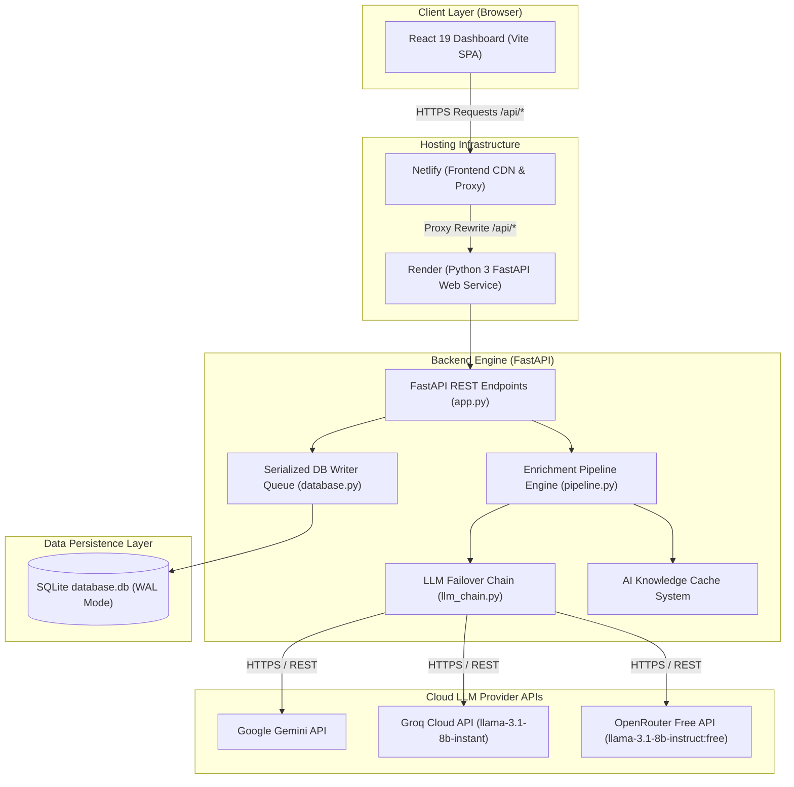
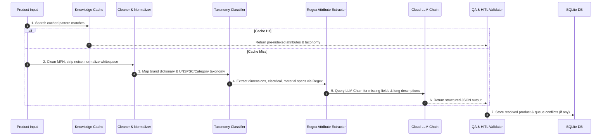

# AI Product Intelligence Platform — System Architecture Overview

This document provides a comprehensive blueprint of the system architecture, component interactions, data pipelines, deployment topology, and post-deployment roadmap.

---

## 🏛️ High-Level System Architecture Diagram



---

## 📦 Core Architecture Layers

### 1. Frontend Layer (React 19 + Vite)
- **Framework**: React 19 single-page application built with Vite and styled using custom modern CSS (dark theme, glassmorphism, micro-animations).
- **Icons**: `lucide-react` (v0.469.0+).
- **State Management**: React state hooks (`useState`, `useEffect`, `useRef`).
- **Routing & Networking**: Relative `/api/...` network requests.
- **Key Modules**:
  - `PipelineStepTracker`: Visual step-by-step indicator (Cache $\rightarrow$ Dedup $\rightarrow$ Normalize $\rightarrow$ Classify $\rightarrow$ Taxonomy $\rightarrow$ Regex $\rightarrow$ LLM $\rightarrow$ QA).
  - `HITL Panel`: Side-by-side conflict resolution UI with one-click **AI Assist**.
  - `Live Terminal`: SSE stream subscriber to `/api/logs/stream` for real-time log feed.

---

### 2. Networking & Proxy Layer (Netlify)
- **Configuration**: Managed via root [`netlify.toml`](file:///c:/Users/Sneha/projects/unihack_real_beginners/netlify.toml) and [`frontend/netlify.toml`](file:///c:/Users/Sneha/projects/unihack_real_beginners/frontend/netlify.toml).
- **Proxy Rewrites**:
  ```toml
  [[redirects]]
    from = "/api/*"
    to = "https://uni-hack-real-beginners.onrender.com/api/:splat"
    status = 200
    force = true
  ```
- **Benefits**: Eliminates CORS preflight delay and keeps API key headers secure.

---

### 3. Backend API Layer (FastAPI on Render)
- **Entry Point**: [`backend/app.py`](file:///c:/Users/Sneha/projects/unihack_real_beginners/backend/app.py) hosted on Render (`uvicorn backend.app:app --host 0.0.0.0 --port $PORT`).
- **Security**:
  - `ALLOWED_ORIGINS` CORS locking.
  - `mask_api_key()` redacts API keys in `GET /api/settings`.
- **Primary Routes**:
  - `GET /api/stats`: High-level metrics (total, enriched, pending, flagged).
  - `GET /api/products`: Paginated product catalogue & filter search.
  - `POST /api/ingest-batch`: Batch CSV/JSON ingestion.
  - `POST /api/run-bulk`: Executes background pipeline across products.
  - `POST /api/products/{id}/resolve-conflict`: Human resolution confirmation.
  - `POST /api/products/{id}/ai-assist`: LLM-guided conflict resolution.
  - `GET /api/logs/stream`: SSE real-time event log stream.

---

### 4. Processing & Enrichment Pipeline ([`backend/pipeline.py`](file:///c:/Users/Sneha/projects/unihack_real_beginners/backend/pipeline.py))



---

### 5. Multi-Provider LLM Failover Chain ([`backend/llm/llm_chain.py`](file:///c:/Users/Sneha/projects/unihack_real_beginners/backend/llm/llm_chain.py))

When an LLM call is required, the system executes an automated failover sequence:

$$\text{Primary: Google Gemini} \xrightarrow{\text{quota/rate limit}} \text{Secondary: Groq Cloud} \xrightarrow{\text{cooldown/rate limit}} \text{Tertiary: OpenRouter Free}$$

- **Google Gemini**: Models `gemini-1.5-flash`, `gemini-3.5-flash`. Handles up to 4096 tokens.
- **Groq Cloud**: Models `llama-3.1-8b-instant`, `llama-3.3-70b-versatile`. Ultra-fast inference with request spacing throttling (1.5s delay).
- **OpenRouter Free Tier**: Models `meta-llama/llama-3.1-8b-instruct:free`, `google/gemma-2-9b-it:free`, `qwen/qwen-2.5-72b-instruct:free`, `deepseek/deepseek-r1:free`.
- **Local Ollama Fallback**: `llama3` on `localhost:11434` (Auto-bypassed when running on cloud servers like Render).

---

### 6. Persistence & Thread-Safe Concurrency ([`backend/database.py`](file:///c:/Users/Sneha/projects/unihack_real_beginners/backend/database.py))
- **Engine**: SQLite (`backend/database.db`) operating with `PRAGMA journal_mode=WAL;`.
- **`DatabaseWriter` Thread**: All DB write queries (`INSERT`, `UPDATE`, `DELETE`) pass through a single, thread-safe FIFO queue (`queue.Queue`) managed by a dedicated background daemon thread.
- **Concurrency Safety**: Implements exponential backoff retries (up to 5 attempts) to eliminate `database is locked` errors during bulk enrichment operations.

---

## 🔮 Post-Deployment Architectural Roadmap

If you want to enhance or scale the application post-deployment, here are the recommended areas:

1. **Persistent Database Storage on Render**:
   - *Current State*: SQLite on Render free tier resets if service restarts.
   - *Enhancement*: Attach a **Render Persistent Disk** mounted to `/backend/data`, or migrate `database.py` to **Render PostgreSQL**.

2. **WebSockets / Server-Sent Events (SSE) Scaling**:
   - *Current State*: Memory-based `logs_broker.py`.
   - *Enhancement*: Add Redis Pub/Sub if scaling backend to multiple worker instances.

3. **Background Job Queue**:
   - *Current State*: FastAPI `BackgroundTasks`.
   - *Enhancement*: Celery + Redis or ARQ for asynchronous task processing across large multi-thousand product CSV uploads.
